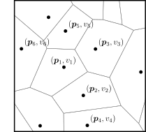
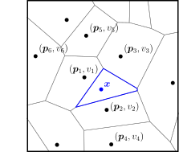
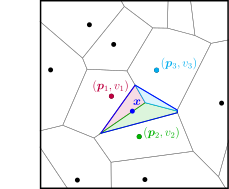
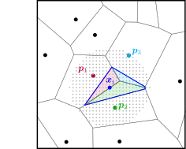
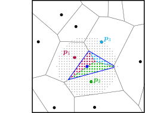
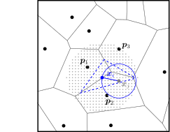
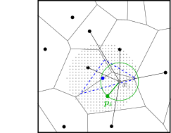
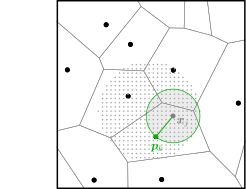

```@meta
CurrentModule = DiscreteNaturalNeighbors
```

# Theory

This page discusses the natural neighbors interpolation method and its efficient implementation using discretized in-cell counts.

## Natural neighbor interpolation

A common computational problem involves the interpolation of a smooth field $f \in \mathbb{R}$ from a set of unstructured points $\{\bm{p}_i\} \in \mathbb{R}^d$ (with $d \geq 2$) with associated values $\{v_i\}  \in \mathbb{R}$. The goal is to interpolate the field $f$ at some positions $\{\bm{x}_i\} \in \mathbb{R}^d$. We consider a scalar field $f$ here for simplicity, although the method can be trivially used to construct the components of e.g. a vector or tensor field $f \in \mathbb{R}^m$

Interpolation from an unstructured grid occurs, for example, in geophysical applications, such as the construction of a smooth temperature map from the measurements of a set of weather stations. [Sibson (1981)](https://www.semanticscholar.org/paper/A-brief-description-of-natural-neighbor-Sibson/1ca6926bf459db0a4d89a8c88b9fd64c32760bc2) proposed an interpolation method for this type of problem that is nowadays commonly known *natural neighbor interpolation*. The Sibson method uses the Voronoi tessellation given by the data points $\{\bm{p}_i \} \in \mathbb{R}^d$ to obtain, for a position $\bm{x}$, a natural estimate of the field value based on the volumes and data values $\{\bm{v}_i \} \in \mathbb{R}^d$ of its neighboring simplices. We schematically outline the procedure for an interpolation from data points in 2D below.

From the given data points $\{\bm{p}_i\}$, one starts by creating the Voronoi tessellation $\mathcal{V}$, where each node has an associated data value $v_i$. This is shown below on the left-hand side. 
To interpolate the field at a position $\bm{x}$, one inserts this node into the unstructured grid and creates the new Voronoi tessellation $\mathcal{V}'$ that includes a simplex associated to $\bm{x}$ (shown on the right-hand side in blue).

     

The field at position $\bm{x}$ is estimated from the values given at the neighboring data points $\bm{p}_i$. To do so, Sibson interpolation evaluates the areas of overlap of the new site's simplex with the respective simplices of the original tessellation $\mathcal{V}$. This is shown in the figure below, where the neighboring nodes whose simplices have non-zero overlap are highlighted in colors, along with their corresponding overlaps in the new simplex.



These areas provide a natural estimate of the weights $w_i$ of the data point $(\bm{p}_i, v_i)$ for the interpolation at the site $\bm{x}$. Denoting by $\mathcal{A}(\bm{p}_i)$ the volume of the $\bm{p}_i$-simplex in $\mathcal{V}$ and by the 
$\mathcal{A}'(\bm{x})$ the volume of the $\bm{x}$-simplex in $\mathcal{V}'$, the field estimate $f(\bm{x})$ is given by the summation

 ```math
f(\bm{x}) = \sum_i w_i v_i =  \sum_i \frac{\mathcal{A}(\bm{p}_i) \cap \mathcal{A}'(\bm{x})}{\mathcal{A}'(\bm{x})} v_i
```

The interpolation can be readily evaluated over a regular or unstructured grid of coordinates $\{\bm{x}_i\}$. We note here that the Sibson method has a couple of advantageous features that make it a favorable interpolation routine. In particular, it constitutes a parameter-free, smooth and spatially adaptive (i.e. adapting to the local data point density) method that requires no statistical assumptions and exactly recovers the values $\{v_i\}$ in the original data points $\{\bm{p}_i\}$.

## Discrete natural neighbor interpolation

Unfortunately, while the Sibson interpolation conceptually is an excellent method for a variety of problems, it is in practice not feasible when the number of data points and/or interpolation sites becomes large. This is because Voronoi tessellations are computationally expensive when the number of grid points becomes large, and every interpolation site requires the calculation of a new tessellation.

[Park et al. (2006)](https://ieeexplore.ieee.org/document/1580458) developed an elegant solution to this problem by proposing an algorithm that mimics the Sibson interpolation, but replaces the area calculations from Voronoi tessellations with in-cell counts over a discretized grid of interpolation points. This method, which the authors refer to as *discrete Sibson interpolation* (and which we will refer to as *discrete natural neighbors*) is highly efficient and allows for applications with large numbers of data points and interpolation sites. Recently, this implementation of the discrete natural neighbors method was used by [Hertzsch et al. (2026)](https://arxiv.org/abs/2604.18209) to interpolate the dark matter displacement fields from 3D cosmological $N$-body simulations with tens of millions of particles.

The discrete natural neighbor method interpolates the field $f$ on a (finely-spaced) regular grid of interpolation sites $\{\bm{x}_i\}$ (shown by the light gray dots below). For a given interpolation site $\bm{x}_i$ (solid blue), one again estimates $f$ as a weighted sum over the values of the neighboring data points. However, now the calculation of the overlap volumes of the simplices is replaced by a count of the grid points contained in the simplices and their intersections, highlighted in colors.

     

Denoting by $\mathcal{S}'(\bm{x}_i)$ the set of points in the $\bm{x}_i$-simplex in $\mathcal{V}'$ and by $\mathcal{S}(\bm{p}_i)$ the set of points in the $\bm{p}_i$-simplex in $\mathcal{V}$, the field estimate at site $\bm{x}_i$ becomes

 ```math
f(\bm{x}_i) = \sum_j w_j v_j = \sum_j \frac{ n(\mathcal{S}'(\bm{x}_i) \cap  \mathcal{S}(\bm{p}_j)) }{n(\mathcal{S}'(\bm{x}_i))} v_j \,,
```

where $n(\mathcal{S})$ denotes the number of elements in $\mathcal{S}$.

This procedure replaces the simplex volume calculation by an in-cell count, but still requires the Voronoi tessellation defining the simplices. One avoids the explicit geometric construction as follows: For a given interpolation site $\bm{x}_i$, one iterates over all interpolation sites $\{\bm{x}_j\}$. For each $\bm{x}_j$, one evaluates the distance to $\bm{x}_i$ and to the (closest) data points $\{\bm{p}_i\}$. The site is contained in the $\bm{x}_i$-simplex if its distance to $\bm{x}_i$ is less than to any data point $\bm{p}_i$, i.e.

 ```math
\mathcal{S}'(\bm{x}_i) = \{ \bm{x}_j \,| \,|| \bm{x}_j - \bm{x}_i || < || \bm{x}_j - \bm{p}_k || \, \forall\,  k\}
```

This is demonstrated below in the left figure, where the site $\bm{x}_j$ (solid gray) is contained in $\mathcal{S}'(\bm{x}_i)$ (dashed blue), because its distance to $\bm{x}_i$ (solid blue) is less than to all data points (solid black). The site therefore contributes to the interpolation estimate at $\bm{x}_i$. To find which data value $v_k$ it contributes, one similarly determines the closed grid point $\bm{p}_k$ to $\bm{x}_j$. This is illustrated in the right figure, where $\bm{x}_j$ is closest to the grid point $\bm{p}_k$ shown in green.

     

By iterating over all candidate sites $\{\bm{x}_j\}$ (i.e. all sides within a maximum distance of $\bm{x}_i$), one thus gathers all the contributions to $f(\bm{x}_i)$, and readily evaluates the summation as given above. 
[Park et al. (2006)](https://ieeexplore.ieee.org/document/1580458) refer to this approach as the 'gathering method'.

However, the authors find that the evaluation efficiency is further increased when adopting instead the 'scattering method'. Here, one again considers the grid site $\bm{x}_j$. It can be seen that all the sites $\bm{x}_i$ that are closer $\bm{x}_j$ than $\bm{x}_j$ is its nearest data point $\bm{p}_k$ will receive a contribution from $\bm{x}_j$. In other words, $\bm{x}_j$ 'scatters' into the hypervolume $\mathcal{B}(\bm{x}_j)$ defined by the distance to its nearest neighbor. This is shown below by the gray circle.

 

For each site $\bm{x}_i \in \mathcal{B}(\bm{x}_j)$, one therefore adds to the current field estimate 
$F(\bm{x}_i)$ the data value $v_k$ of the closed data point $\bm{p}_k$ to $\bm{x}_j$. One also adds unity to the variable $N(\bm{x}_i)$ counting contributions to the site $\bm{x}_i$. The field estimates for all interpolation sites $\{\bm{x}_i\}$ are obtained by initializing $F(\bm{x}_i)=0, N(\bm{x}_i)=0\, \forall\, i$ and iterating the scattering procedure over all sites $\{\bm{x}_i\}$.
Finally, the field estimates are divided by the numbers of contributions, $f(\bm{x}_i) = F(\bm{x}_i) / N(\bm{x}_i)$. This is analogous to the normalization of the overlap volume by the total simplex volume in the Voronoi construction above.

The scattering method can be efficiently evaluated as, for a given grid cell, the nearest neighbor data point can be efficiently searched from a pre-computed $k$-d tree of all data points, and the assignment of data values is reduced to a small loop over grid cells in $\mathcal{B}(\bm{x}_j)$.

## Remarks

**Algorithmic efficiency**: Due to the inner loop over the scatter contributions in the hypervolume $\mathcal{B}(\bm{x}_j)$, the algorithm has a particular runtime. Ignoring the contribution from the data point search tree, and denoting by $N$ the number of interpolation sites, the runtime approaches $\mathcal{O}(N^2)$ if the number of interpolation sites is much larger than the number of grid points $M$. That is, if the $\mathcal{B}(\bm{x}_j)$ becomes comparable to the overall interpolation grid, and the inner loop scales as $\mathcal{O}(N)$. Conversely, if the number of interpolation sites $N$ becomes comparable to the number of grid points $M$, then the runtime of the inner loop approaches $\mathcal{O}(1)$ (i.e. $\mathcal{B}(\bm{x}_j)$ is much smaller than the overall interpolation grid), and the runtime is dominated by the look-up of the nearest neighbor in the $k$-d tree, which typically runs as $\mathcal{O}(M \log M)$ and is called over $N\approx M$ grid cells, thus leading to $\mathcal{O}(M^2 \log M)$ overall.

**Underdense interpolation grid**: The algorithm and code do not fail if the number of interpolation sites is comparable to or less than the number of given data; that is, if the spacing of the interpolation points is larger than the typical distance between nearest-neighbor data points. However, the method ceases to accurately approximate the Voronoi simplex volume in this case, and the inner loop of the scatter method may in the worst case be reduced to a single element (the candidate point $\bm{x}_j$ in the figure above), to which the value of the nearest-neighbor data point is assigned.